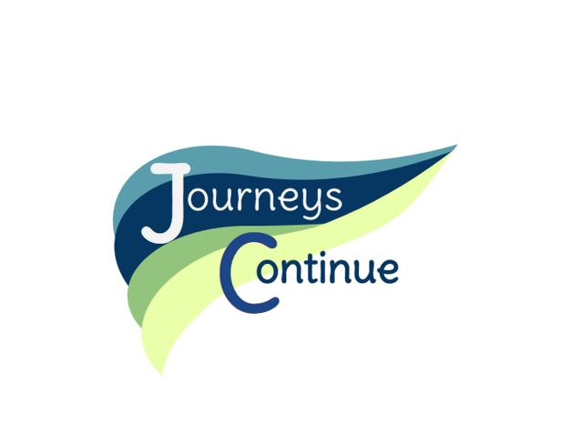

<!-- ! If you can read this comment, please preview this file with a markdown renderer -->

Moved to https://github.com/Tim-W-James/Journeys-Continue

<!--
*** README forked from the Best-README-Template: https://github.com/othneildrew/Best-README-Template
*** Forked by Tim James: https://github.com/Tim-W-James/README-Template
***
*** See the TODO lists for project setup.
*** Find a list of resources for writing markdown, etc. at the end of this file.
-->

<!-- PROJECT LOGO -->
 

   

  <h2 align="center">Journeys Continue Website</h2>

  

    Website for Journeys Continue, an Australian business for social work, disability and aged care services: <a href="https://journeyscontinue.com.au/">https://journeyscontinue.com.au/</a>
     
<!--     <a href="https://github.com/Tim-W-James/Journeys-Continue"><strong>Explore the docs »</strong></a>
      
      -->
<!--     <a href="https://github.com/Tim-W-James/Journeys-Continue">View Demo</a> -->
<!--     ·
    <a href="https://github.com/Tim-W-James/Journeys-Continue/issues">Report Bug</a> -->
<!--     ·
    <a href="https://github.com/Tim-W-James/Journeys-Continue/issues">Request Feature</a> -->
  

<!-- TABLE OF CONTENTS -->

  
Table of Contents

  <ol>
    <li>
      <a href="#about-the-project">About The Project</a>
      <ul>
        <li><a href="#features">Features</a></li>
        <li><a href="#built-with">Built With</a></li>
      </ul>
    </li>
    <li><a href="#contact">Contact</a></li>
    <li><a href="#acknowledgements">Acknowledgements</a></li> 
  </ol>

<!-- ABOUT THE PROJECT -->

## About The Project

<!-- [![Product Name Screen Shot][product-screenshot]](https://example.com) -->

Website created for Journeys Continue, an Australian business for social work, disability and aged care services.
Various functions of the site will not function (links due to the use of .htaccess, etc.) in the repo, so visit the site here: [journeyscontinue.com.au/](https://journeyscontinue.com.au/).

<!-- CONTACT -->

## Contact

Email: [tim.jameswork9800@gmail.com](mailto:tim.jameswork9800@gmail.com "tim.jameswork9800@gmail.com")

Project Link:
[https://github.com/Tim-W-James/Journeys-Continue](https://github.com/Tim-W-James/Journeys-Continue)

<!-- USEFUL LINKS FOR MARKDOWN
* https://github.com/Tim-W-James/blog/blob/master/Markdow-Cheatsheet.md
* https://www.markdownguide.org/basic-syntax
* https://www.webpagefx.com/tools/emoji-cheat-sheet
* https://shields.io
* https://choosealicense.com
* https://pages.github.com
* https://daneden.github.io/animate.css
* https://connoratherton.com/loaders
* https://kenwheeler.github.io/slick
* https://github.com/cferdinandi/smooth-scroll
* http://leafo.net/sticky-kit
* http://jvectormap.com
* https://fontawesome.com -->
